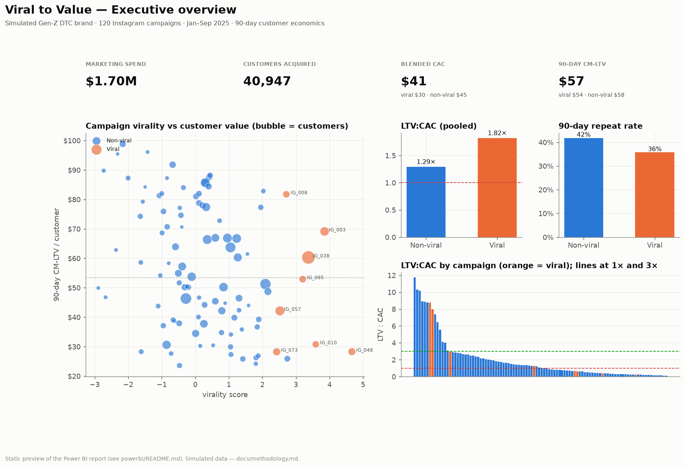

# Viral to Value

**Do viral Instagram campaigns acquire durable, high-value customers — or mostly generate temporary revenue spikes?**

Viral to Value investigates whether Instagram virality translates into sustainable customer economics for a
Gen-Z DTC streetwear brand. Using customer-level acquisition, transaction, campaign and cost data, the analysis
compares short-term campaign performance (reach, first-week revenue, ROAS, CAC) with 30/60/90-day retention,
repeat purchasing, contribution-margin LTV and LTV:CAC. The objective is to distinguish campaigns that merely
generate attention from campaigns that create durable economic value.

> **Data note.** This project uses a simulated DTC e-commerce dataset designed to reproduce realistic customer
> acquisition, campaign, transaction, retention and profitability behaviour. Results describe the simulated
> business and are not empirical claims about Instagram users generally. The simulator contains **no
> "viral ⇒ bad customer" rule** — see [`docs/methodology.md`](docs/methodology.md).



## The business decision

A Gen-Z DTC brand with a limited marketing budget has to choose: keep optimising Instagram campaigns for
virality and reach, or optimise for the kind of engagement that produces profitable long-term customers?

## Findings

| | Non-viral (112 campaigns) | Viral (8 campaigns) |
|---|---:|---:|
| Customers acquired | 31,808 | 9,139 |
| CAC | $45 | $30 |
| 7-day ROAS | 1.9× | 3.0× |
| 90-day repeat rate | 42 % | 36 % |
| 90-day CM-LTV per customer | $58 | $54 |
| **LTV : CAC (90-day)** | **1.29×** | **1.82×** |

1. **Virality wins the short term.** Viral campaigns (top-decile reach *and* top-quartile share rate) acquire
   customers for two-thirds of the CAC and post better first-week ROAS. Pooled, they beat non-viral campaigns on
   90-day LTV:CAC because acquisition is so cheap.
2. **But viral customers are slightly less durable.** They repeat 6 points less at 90 days and are worth a few
   dollars less in contribution margin. The effect is statistically clear (n ≈ 41k) but small: Cliff's δ ≈ −0.02,
   Cramér's V ≈ 0.05.
3. **"Viral" is not one thing.** The eight viral cohorts range from $28 to $82 in 90-day CM-LTV and from 17 % to
   47 % repeat — a wider spread than the gap between viral and non-viral.
4. **What separates profitable virality from vanity virality:**
   - **Saves beat shares.** Save rate is the strongest engagement predictor of customer value (+$12.5 of 90-day
     CM-LTV per +1 pt, p < 0.001); share rate is negatively correlated and not significant once save rate is known.
   - **Discounts buy the spike and lose the customer.** Each point of first-order discount removes ≈ $1.30 of
     CM-LTV; 20–30 % campaigns repeat at 29 % vs 47 % for full-price campaigns.
   - **Trusted creators over big creators.** Micro/Mid creator cohorts repeat at 42–46 %, Macro at 32 %; Macro
     campaigns lost money at 90 days.
   - **Reach itself is irrelevant to value** once those are controlled (log reach not significant; the `is_viral`
     odds ratio moves from 0.77 to 0.91 with controls).
5. **Durable customers can be spotted by day 7** (ROC-AUC ≈ 0.68): the top-scored 20 % of new customers repeat
   at 1.6× the base rate and hold ≈ 38 % of 90-day margin. The signals are behavioural — return visits, first-order
   value, discount used, an early refund — plus creator tier and the campaign's save rate. Virality features add
   < 0.01 AUC.

**Recommendation.** Keep chasing reach, but only with content built to be *saved* (product-led Reels and
carousels, drops, UGC) and without deep discount codes. Judge campaigns on 90-day LTV:CAC and payback, not on
views or first-week ROAS. About half of all campaigns have not paid back at 90 days — a budget problem, and not a
viral-vs-non-viral one.

Full write-up: [`reports/executive_summary.pdf`](reports/executive_summary.pdf).

## Analysis structure

| stage | question | notebook | technique |
|---|---|---|---|
| Data quality | can we trust the tables? | [01](notebooks/01_data_quality.ipynb) | key/FK/accounting checks, observation window |
| Exploration | what does the business look like? | [02](notebooks/02_exploratory_analysis.ipynb) | mix, spend vs reach, margin waterfall, funnel |
| Virality & spike | which campaigns went viral; what happened in week 1? | [03](notebooks/03_campaign_analysis.ipynb) | reach + share-rate definition, event-time revenue, 7-day ROAS, CAC |
| Retention | do the customers return? | [04](notebooks/04_customer_cohorts.ipynb) | 30/60/90 repeat, repeat curves, cohort heatmap, cumulative CM |
| Profitability | are they economically valuable? | [05](notebooks/05_profitability_analysis.ipynb) | CAC, CM-LTV, LTV:CAC, payback, budget scenario |
| Explanation | is the difference real; what drives it? | [06](notebooks/06_statistical_analysis.ipynb) | Mann–Whitney, Cliff's δ, bootstrap CIs, χ², weighted OLS, logistic with controls |
| Early signals | who will be durable, by day 7? | [07](notebooks/07_customer_model.ipynb) | logistic vs RF vs GBM, time-based split, permutation importance, decile lift |

### Key definitions

```
share rate        = shares / reach                 save rate = saves / reach
viral             = reach ≥ p90  AND  share rate ≥ p75
virality score    = z(log reach) + z(log share rate)

contribution margin = net revenue − COGS − shipping − payment fees − refunds
90-day CM-LTV       = contribution margin from orders in the first 90 days after acquisition
CAC                 = campaign spend / customers acquired
LTV : CAC           = 90-day CM-LTV / CAC
```

## Data model

Star schema, ~41k customers, ~80k orders, ~812k sessions, 120 campaigns, 40 products.

```
campaigns ──< customers ──< orders >── products
    │              │
    └──────< sessions >────┘
```

Tables and every column are described in [`docs/data_dictionary.md`](docs/data_dictionary.md); simulation
parameters and limitations in [`docs/assumptions.md`](docs/assumptions.md).

## Repository

```
viral-to-value/
├── README.md
├── requirements.txt
├── data/
│   ├── raw/            campaigns, customers, sessions*, orders, products   (*sessions.csv is git-ignored: 75 MB)
│   ├── processed/      cleaned tables + analytical outputs
│   └── simulation/     generator's hidden variables (never read by the analysis)
├── src/
│   ├── generate_data.py   simulation (non-biased by design)
│   ├── clean_data.py      typing, integrity checks, contribution margin
│   ├── metrics.py         virality, cohort, CAC / LTV / LTV:CAC, payback, effect sizes
│   ├── features.py        day-7 features for the customer model
│   ├── run_sql.py         builds a DuckDB warehouse and runs sql/
│   ├── export_powerbi.py  Power BI import tables
│   ├── build_report.py    executive summary PDF + dashboard preview
│   └── viz.py             shared chart style
├── notebooks/          01 → 07 (executed, outputs included)
├── sql/                schema.sql, acquisition.sql, retention.sql, campaign_metrics.sql, customer_ltv.sql
├── powerbi/            README (model + pages), measures.dax, data/ extracts
├── reports/            executive_summary.pdf
├── images/             all figures + dashboard_preview.png
└── docs/               data_dictionary.md, methodology.md, assumptions.md
```

## SQL

PostgreSQL-syntax scripts (CTEs, window functions `ROW_NUMBER` / `LAG`, `FILTER`, `percentile_cont`,
date arithmetic) that reproduce the acquisition funnel, retention, customer LTV and the campaign scorecard.
They run unchanged on DuckDB for local use:

```bash
python src/run_sql.py --export
```

## Power BI

The `.pbix` must be authored in Power BI Desktop (Windows); the repo ships the star-schema extracts
(`python src/export_powerbi.py`), the relationship model, all DAX measures and the four-page layout
(Executive Overview · Campaign Performance · Customer Durability · Financial Performance) in
[`powerbi/README.md`](powerbi/README.md). `images/dashboard_preview.png` is a static render of the same numbers.

## Reproduce

```bash
git clone <repo> && cd viral-to-value
python -m venv .venv && source .venv/bin/activate
pip install -r requirements.txt
python src/generate_data.py                 # data/raw   (seed 42, ~1 min)
python src/clean_data.py                    # data/processed
python src/run_sql.py --export              # SQL outputs
jupyter nbconvert --execute --to notebook --inplace notebooks/0*.ipynb
python src/export_powerbi.py
python src/build_report.py
```

## Stack

Python 3.12+ · pandas · NumPy · Matplotlib · scikit-learn · SciPy · Jupyter · PostgreSQL-style SQL (DuckDB
locally) · Power BI / DAX · Git.
